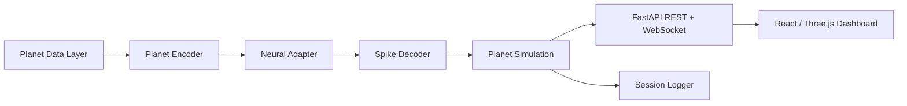

# GAIA-1: Earth Dreams

**The first neuron-ready planetary simulator.**

Live planetary signals encoded into simulated neural activity, decoded back into a living digital Earth.

GAIA-1 is a local MVP for a scientific/artistic technology demo. It connects synthetic or optional live planetary signals to stimulation intents, reads simulated neural spikes through the Cortical Labs CL SDK Simulator when available, decodes those spikes into metaphorical planet-control actions, and streams a changing digital Earth to a realtime dashboard.

## What This Is

GAIA-1 is a **neuron-ready prototype built with the Cortical Labs CL SDK Simulator, designed for future deployment to real biological neural networks through CL1/Cortical Cloud**.

It includes:

- FastAPI backend with REST and WebSocket endpoints.
- Cortical Labs simulator adapter using `import cl`, `cl.open()`, `neurons.loop(...)`, `tick.analysis.spikes`, optional `record()`, and optional data streams.
- Deterministic fallback adapter for machines without `cl-sdk`.
- Mock/offline planetary data provider with optional connector structure for live APIs.
- Planet encoder, spike decoder, planet simulation, local session logging.
- Vite + React + TypeScript dashboard with a Three.js Earth visualization.
- Basic backend tests.

## What This Is Not

This MVP is **not connected to real neurons**. It does **not** demonstrate biological learning, consciousness, sentience, suffering, thought, or emotion. The channel groups and decoded actions are visualization metaphors, not scientific claims about neural meaning.

The Cortical Labs CL SDK Simulator generates non-learning control data and does not respond causally to stimulation. GAIA-1 records stimulation intents for future CL1/Cortical Cloud adaptation, but in simulator mode those intents should not be interpreted as driving real neural behavior.

## Architecture



### Backend Layers

- `PlanetDataProvider`: generates offline planetary signals and derived scores. Optional live connector hooks are prepared but mock mode is the reliable default.
- `PlanetEncoder`: normalizes planet variables into stimulation intents with target channels, intensity, burst frequency, and a signature.
- `NeuralAdapter`: common interface for simulator/fallback implementations.
- `CorticalSimulatorAdapter`: attempts to use `cl-sdk` and the official `cl` API surface.
- `FallbackSyntheticAdapter`: deterministic synthetic spikes when `cl-sdk` is missing and fallback is allowed.
- `SpikeDecoder`: converts spikes into visualization metrics and metaphorical actions.
- `PlanetSimulation`: evolves the digital planet state.
- `SimulationRunner`: controls start/stop/reset, history, WebSocket broadcast, and JSONL logging.

## Install

Backend:

```bash
python -m venv .venv
source .venv/bin/activate
pip install -r backend/requirements.txt
uvicorn app.main:app --reload --port 8000 --app-dir backend
```

Windows PowerShell:

```powershell
py -3.12 -m venv .venv
.\.venv\Scripts\Activate.ps1
pip install -r backend\requirements.txt
uvicorn app.main:app --reload --port 8000 --app-dir backend
```

Frontend:

```bash
cd frontend
npm install
npm run dev
```

Open [http://localhost:5173](http://localhost:5173).

## Scripts

PowerShell helpers are included:

```powershell
.\scripts\run_backend.ps1
.\scripts\run_frontend.ps1
```

Unix-like systems can use the `Makefile`:

```bash
make backend
make frontend
make test
```

## Configuration

Copy `.env.example` to `.env` and adjust as needed.

Important values:

- `GAIA_MODE=simulator`: prefer the Cortical Labs CL SDK Simulator.
- `GAIA_ALLOW_FALLBACK=true`: use deterministic fallback if `cl-sdk` is unavailable.
- `GAIA_USE_LIVE_DATA=false`: keep reliable offline mock signals.
- `GAIA_TICKS_PER_SECOND=10`: frontend-friendly realtime update rate.
- `GAIA_ENABLE_CL_RECORDING=false`: turn on only when you want CL SDK HDF5 recordings.
- `GAIA_ENABLE_CL_DATA_STREAM=true`: attempts to publish `gaia_earth_dreams_state`.
- `GAIA_ENABLE_CL_STIMULATION=false`: keep stimulation as logged intent only in this MVP.

CL SDK simulator values:

- `CL_SDK_RANDOM_SEED=42`
- `CL_SDK_VISUALISATION=1`
- `CL_SDK_ACCELERATED_TIME=0`
- `CL_SDK_SPIKE_VISIBILITY=1`

## API

- `GET /`
- `GET /health`
- `GET /api/state`
- `GET /api/history?limit=200`
- `POST /api/control/start`
- `POST /api/control/stop`
- `POST /api/control/reset`
- `POST /api/control/demo-event`
- `WS /ws/live`

Demo event body:

```json
{
  "type": "wildfire",
  "intensity": 0.8
}
```

Allowed event types:

- `wildfire`
- `earthquake`
- `heatwave`
- `good_news`
- `conflict`
- `renewable_boost`

## Logs And Recordings

Each backend run creates a `session_id`. When `GAIA_LOG_TO_FILE=true`, states are written as JSONL under:

- `backend/data/logs/`
- `backend/data/sessions/`

If CL SDK recording is enabled and supported by the local simulator, recordings are directed to:

- `backend/data/recordings/`

## Tests

```bash
pytest backend/tests
```

The tests cover health/state endpoints, mock planet data generation, encoder output ranges, decoder behavior with fake spikes, simulation steps, and demo event injection.

## Future CL1 / Cortical Cloud Adaptation

The backend intentionally isolates neural hardware concerns behind `NeuralAdapter`. A future real deployment should add a dedicated adapter that:

- Authenticates/deploys through the available CL1 or Cortical Cloud workflow.
- Converts `StimulationIntent` into reviewed `ChannelSet`, `StimDesign`, `BurstDesign`, or stimulation plans.
- Applies biological safety constraints, rate limits, recording policies, and experiment approval gates.
- Treats every visualization label as UI metaphor unless validated by a real scientific protocol.

The current simulator adapter already keeps the same high-level flow: open `cl`, loop over ticks, read spikes, log intents, and optionally create data streams/recordings.

## Roadmap

- Add real public data connectors for climate, earthquakes, wildfire, air quality, and news sentiment.
- Add replay mode for CL SDK recordings.
- Add exportable demo sessions with charts.
- Add a Cloud/CL1 adapter once access and deployment details are available.
- Add stronger experiment-safety review controls before any real biological stimulation.

## References

- [Cortical Labs Developer Guide](https://docs.corticallabs.com/)
- [Cortical Labs CL SDK Simulator](https://github.com/Cortical-Labs/cl-sdk)
- [Cortical Labs CL API Docs](https://github.com/Cortical-Labs/cl-api-doc)
- [Cortical Cloud](https://corticallabs.com/cloud)
