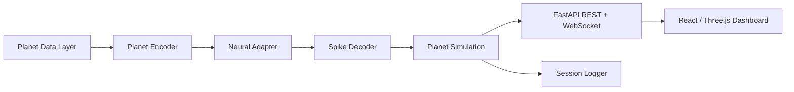

# GAIA-1: Earth Dreams

**The first neuron-ready planetary simulator.**

Live planetary signals encoded into simulated neural activity, decoded back into a living digital Earth.

GAIA-1 is a local MVP for a scientific/artistic technology demo. It connects synthetic or optional live planetary signals to stimulation intents, reads simulated neural spikes through the Cortical Labs CL SDK Simulator when available, decodes those spikes into metaphorical planet-control actions, and streams a changing digital Earth to a realtime dashboard.

## What This Is

GAIA-1 is a **neuron-ready prototype built with the Cortical Labs CL SDK Simulator, designed for future deployment to real biological neural networks through CL1/Cortical Cloud**.

It includes:

- FastAPI backend with REST and WebSocket endpoints.
- Cortical Labs simulator adapter using `import cl`, `cl.open()`, `neurons.loop(...)`, `tick.analysis.spikes`, optional `record()`, and optional data streams.
- Deterministic fallback adapter for machines without `cl-sdk`.
- Real-data planetary layer: per-user API keys configured from an in-app Settings panel, with 10 live connectors (7 key-free) and a strict mode that shows only the sources you have activated. A `demo` mode keeps the legacy offline mock signals.
- Planet encoder, spike decoder, planet simulation, local session logging.
- Vite + React + TypeScript dashboard with a Three.js Earth visualization.
- Basic backend tests.
- Operational status/config/session endpoints and developer smoke-test scripts.

## What This Is Not

This MVP is **not connected to real neurons**. It does **not** demonstrate biological learning, consciousness, sentience, suffering, thought, or emotion. The channel groups and decoded actions are visualization metaphors, not scientific claims about neural meaning.

The Cortical Labs CL SDK Simulator generates non-learning control data and does not respond causally to stimulation. GAIA-1 records stimulation intents for future CL1/Cortical Cloud adaptation, but in simulator mode those intents should not be interpreted as driving real neural behavior.

## Architecture



### Backend Layers

- `PlanetDataProvider`: generates offline planetary signals and derived scores. Optional live connector hooks are prepared but mock mode is the reliable default.
- `PlanetEncoder`: normalizes planet variables into stimulation intents with target channels, intensity, burst frequency, and a signature.
- `NeuralAdapter`: common interface for simulator/fallback implementations.
- `CorticalSimulatorAdapter`: attempts to use `cl-sdk` and the official `cl` API surface.
- `FallbackSyntheticAdapter`: deterministic synthetic spikes when `cl-sdk` is missing and fallback is allowed.
- `SpikeDecoder`: converts spikes into visualization metrics and metaphorical actions.
- `PlanetSimulation`: evolves the digital planet state.
- `SimulationRunner`: controls start/stop/reset, history, WebSocket broadcast, and JSONL logging.

## Install

Backend:

```bash
python -m venv .venv
source .venv/bin/activate
pip install -r backend/requirements.txt
uvicorn app.main:app --reload --port 8000 --app-dir backend
```

Windows PowerShell:

```powershell
py -3.12 -m venv .venv
.\.venv\Scripts\Activate.ps1
pip install -r backend\requirements.txt
uvicorn app.main:app --reload --port 8000 --app-dir backend
```

Frontend:

```bash
cd frontend
npm install
npm run dev
```

Open [http://localhost:5173](http://localhost:5173).

If `5173` is already in use, Vite can run on another port such as `5174`; the backend CORS defaults allow both.

## Scripts

PowerShell helpers are included:

```powershell
.\scripts\run_backend.ps1
.\scripts\run_frontend.ps1
```

Python helpers:

```bash
python scripts/check_env.py
python scripts/run_backend.py
python scripts/smoke_test.py
```

Unix-like systems can use the `Makefile`:

```bash
make backend
make frontend
make test
```

## Configuration

Copy `.env.example` to `.env` and adjust as needed.

Important values:

- `GAIA_MODE=simulator`: prefer the Cortical Labs CL SDK Simulator.
- `GAIA_ALLOW_FALLBACK=true`: use deterministic fallback if `cl-sdk` is unavailable.
- `GAIA_DATA_MODE=live`: strict real-data mode (only configured sources are shown). Set `demo` for the legacy simulated planet + demo globe events.
- `GAIA_USE_LIVE_DATA=false`: legacy flag retained for compatibility; per-source activation now controls live data.
- `GAIA_TICKS_PER_SECOND=10`: frontend-friendly realtime update rate.
- `GAIA_ENABLE_CL_RECORDING=false`: turn on only when you want CL SDK HDF5 recordings.
- `GAIA_ENABLE_CL_DATA_STREAM=true`: attempts to publish `gaia_earth_dreams_state`.
- `GAIA_ENABLE_CL_STIMULATION=false`: keep stimulation as logged intent only in this MVP.

CL SDK simulator values:

- `CL_SDK_RANDOM_SEED=42`
- `CL_SDK_VISUALISATION=1`
- `CL_SDK_ACCELERATED_TIME=0`
- `CL_SDK_SPIKE_VISIBILITY=1`

## API

- `GET /`
- `GET /health`
- `GET /api/status`
- `GET /api/state`
- `GET /api/history?limit=200`
- `GET /api/config`
- `GET /api/sessions`
- `POST /api/control/start`
- `POST /api/control/stop`
- `POST /api/control/reset`
- `POST /api/control/demo-event`
- `GET /api/events/live` — current geolocated events from the user's active sources. In `live` mode this is strictly real data (no demo fallback); in `demo` mode it returns simulated events. Add `?refresh=true` to force a live refresh.
- `GET /api/sources` — full data-source catalog with per-user state (configured / enabled / active, masked credentials, last health). Never returns raw secrets.
- `PUT /api/sources/{id}/credentials` — save a source's API key(s) and enable it.
- `DELETE /api/sources/{id}/credentials` — remove a source's stored key.
- `POST /api/sources/{id}/toggle` — enable/disable a source.
- `POST /api/sources/{id}/test` — run one live fetch to confirm what real data the credentials reach.
- `WS /ws/live` — each `SimulationFrame` carries `events_geo` (geolocated events for the globe) and `signal_provenance` (which planet-input fields are backed by a real source).

Demo event body:

```json
{
  "type": "wildfire",
  "intensity": 0.8,
  "duration_seconds": 30
}
```

Allowed event types:

- `wildfire`
- `earthquake`
- `heatwave`
- `good_news`
- `conflict`
- `renewable_boost`
- `ocean_recovery`
- `pollution_spike`
- `biodiversity_gain`
- `solar_storm`

## Real-Time Earth Globe

The dashboard centerpiece is `RealTimeEarthGlobe` (`frontend/src/components/Visuals/`):
a rotating, interactive 3D Earth with atmosphere, drifting clouds, a star field,
and geolocated event markers (pulses, particles, arcs) that react to planet
state, simulated neural metrics, and decoded actions.

Event sources are merged by priority and de-duplicated by id:

1. `events_geo` embedded in the WebSocket `SimulationFrame`.
2. `GET /api/events/live` (polled while no WebSocket events).
3. Local demo events (`frontend/src/data/demoGeoEvents.ts`) — always available.

**Real data (per-user API keys):** GAIA-1 runs in strict **live mode** by
default. Open the **Data Sources** button (gear, top-right) to connect real
planetary sensors with *your own* credentials. The globe and "Live Sensors"
panel show **only** the sources you have activated — anything unconfigured is
visibly disabled, never faked. Keys are stored locally in
`backend/data/credentials.json` (gitignored) and never leave your backend; the
API only ever exposes masked values. Set `GAIA_DATA_MODE=demo` to restore the
legacy simulated planet + demo globe events.

See [Real Data Sources](#real-data-sources) for the full list. Several work with
**no key at all** (USGS, NASA EONET, GDACS, ISS, Open-Meteo, GDELT, NOAA SWPC),
so the globe lights up with real events out of the box.

**Earth textures:** the globe ships with a procedural canvas Earth so it works
with zero assets. To use photographic textures, drop them in
`frontend/public/textures/earth/` (see that folder's `README.md` for filenames
and public-domain NASA sources).

## Real Data Sources

Each user connects their own sensors from the in-app **Data Sources** panel. The
catalog is declarative (`backend/app/services/data_sources/catalog.py`) — adding
a source is one catalog entry plus one connector following the existing
`GeoEventConnector` / `SignalConnector` protocol.

v1 ships 10 sources:

| Source | Category | Type | Key | Feeds |
| --- | --- | --- | --- | --- |
| USGS Earthquakes | geophysics | globe markers | none | earthquakes |
| NASA EONET | geophysics | globe markers | none | wildfires/storms/volcanoes |
| GDACS | geophysics | globe markers | none | disaster alerts |
| ISS | movement | globe marker | none | live ISS position |
| NASA FIRMS | geophysics | globe markers | **MAP_KEY** | active fires, wildfire risk |
| Open-Meteo | atmosphere | signals | none | air quality, precipitation |
| OpenWeatherMap | atmosphere | signals | **API key** | air quality |
| OpenAQ | atmosphere | signals | **API key** | air quality (ground stations) |
| GDELT | society | signals | none | news tension/sentiment/conflict |
| NOAA SWPC | space | signals | none | geomagnetic storm (Kp) |

Where to get the keys: FIRMS `MAP_KEY` →
<https://firms.modaps.eosdis.nasa.gov/api/map_key/>, OpenWeather →
<https://home.openweathermap.org/users/sign_up>, OpenAQ →
<https://explore.openaq.org/register>. The "Test connection" button in Settings
runs a real fetch so you can confirm what data a key reaches before relying on it.

The remaining catalog (NWS alerts, Smithsonian volcanoes, Electricity Maps, EIA,
OpenSky, AISStream, NASA DONKI, ReliefWeb, GBIF, Cloudflare Radar, WAQI, IQAir…)
is added incrementally the same way.

## Troubleshooting

- If `cl-sdk` is unavailable, set `GAIA_ALLOW_FALLBACK=true`; the backend will report `Fallback Synthetic Mode`.
- If the CL SDK simulator reports timing jitter, lower `GAIA_TICKS_PER_SECOND` or keep `CL_SDK_VISUALISATION=0` for backend demos.
- If the frontend cannot connect, check `VITE_API_BASE_URL`, `VITE_WS_URL`, and CORS origins.
- If port `5173` is occupied, run `npm run dev -- --port 5174`.
- If `/api/state` returns tick `0`, call `POST /api/control/start` or use the frontend Start button.

## Logs And Recordings

Each backend run creates a `session_id`. When `GAIA_LOG_TO_FILE=true`, states are written as JSONL under:

- `backend/data/logs/`
- `backend/data/sessions/`

If CL SDK recording is enabled and supported by the local simulator, recordings are directed to:

- `backend/data/recordings/`

## Tests

```bash
pytest backend/tests
```

The tests cover health/state endpoints, mock planet data generation, encoder output ranges, decoder behavior with fake spikes, simulation steps, and demo event injection.

## Future CL1 / Cortical Cloud Adaptation

The backend intentionally isolates neural hardware concerns behind `NeuralAdapter`. A future real deployment should add a dedicated adapter that:

- Authenticates/deploys through the available CL1 or Cortical Cloud workflow.
- Converts `StimulationIntent` into reviewed `ChannelSet`, `StimDesign`, `BurstDesign`, or stimulation plans.
- Applies biological safety constraints, rate limits, recording policies, and experiment approval gates.
- Treats every visualization label as UI metaphor unless validated by a real scientific protocol.

The current simulator adapter already keeps the same high-level flow: open `cl`, loop over ticks, read spikes, log intents, and optionally create data streams/recordings.

## Roadmap

- Add real public data connectors for climate, earthquakes, wildfire, air quality, and news sentiment.
- Add replay mode for CL SDK recordings.
- Add exportable demo sessions with charts.
- Add a Cloud/CL1 adapter once access and deployment details are available.
- Add stronger experiment-safety review controls before any real biological stimulation.

More detail:

- [Architecture](docs/ARCHITECTURE.md)
- [Ethics And Limitations](docs/ETHICS_AND_LIMITATIONS.md)
- [Roadmap](docs/ROADMAP.md)

## References

- [Cortical Labs Developer Guide](https://docs.corticallabs.com/)
- [Cortical Labs CL SDK Simulator](https://github.com/Cortical-Labs/cl-sdk)
- [Cortical Labs CL API Docs](https://github.com/Cortical-Labs/cl-api-doc)
- [Cortical Cloud](https://corticallabs.com/cloud)
