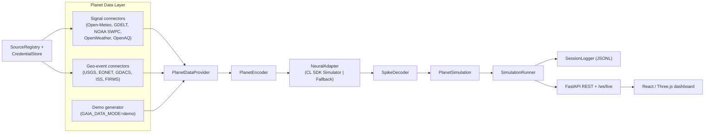

# GAIA-1: Earth Dreams

> **A neuron-ready planetary simulator:** live planetary signals are encoded into stimulation intents, simulated neural spikes are decoded back into metaphorical actions, and a digital Earth evolves on a real-time 3D dashboard.

**Status:** Local MVP / Proof of Concept · **Origin:** Personal project (technical and artistic experiment) · **Period:** June 2026

> [!IMPORTANT]
> **Simulator mode: no real neurons are connected.** GAIA-1 runs on the Cortical Labs CL SDK *Simulator* (or on a synthetic fallback). It does not demonstrate biological learning, consciousness, sentience, thought, or emotion. Channel groups and decoded actions are visualization metaphors, not neuroscience claims. See [Ethics and Limitations](docs/ETHICS_AND_LIMITATIONS.md).

---

## Table of Contents

- [Project Overview](#project-overview)
- [Project Context](#project-context)
- [Problem Statement](#problem-statement)
- [Objective](#objective)
- [Original Implementation](#original-implementation)
- [Repository Structure](#repository-structure)
- [Technologies](#technologies)
- [How It Works](#how-it-works)
- [Architecture](#architecture)
- [Inputs and Outputs](#inputs-and-outputs)
- [Running the Project](#running-the-project)
- [Configuration](#configuration)
- [API Reference](#api-reference)
- [Real Data Sources](#real-data-sources)
- [Tests](#tests)
- [Documentation](#documentation)
- [Historical Note](#historical-note)
- [References](#references)

---

## Project Overview

GAIA-1 is a full-stack prototype made of a **FastAPI backend** and a **React + Three.js dashboard**. At a configurable tick rate (10 ticks per second by default), the backend:

1. collects **planetary signals** (earthquakes, wildfires, air quality, news tone, geomagnetic activity, and more) from public APIs or from a synthetic demo generator;
2. **encodes** them into a `StimulationIntent` (target channels on a 64-channel array, intensity, burst frequency);
3. reads **spikes** from a neural adapter: the Cortical Labs CL SDK Simulator when it is installed, or a deterministic synthetic fallback;
4. **decodes** the spikes into neural metrics and a metaphorical "planet action" (e.g. `cool_planet`, `restore_biosphere`, `amplify_chaos`);
5. **evolves** a digital planet state and streams each frame over a WebSocket to the dashboard, where a rotating 3D globe shows geolocated events.

The architecture keeps the neural hardware behind a single `NeuralAdapter` interface. The stated intent is to connect it to real biological neural networks through Cortical Labs CL1 / Cortical Cloud **in the future**, and only after safety and ethics review.

## Project Context

| Aspect | Finding | Evidence level |
| --- | --- | --- |
| Project type | **Personal Project**: a technical and artistic **Proof of Concept / MVP** | Inferred from the docs ("local MVP for a scientific/artistic technology demo"; "educational, experimental, artistic, and technical") |
| Academic context | No university, course, or assignment is referenced anywhere | Confirmed (absence of evidence) |
| Author | Baruch Lopez (sole author in git history) | Confirmed |
| Development period | 16–18 June 2026 (3 commits + 1 merged PR) | Confirmed (git history) |
| Maturity | MVP; roadmap phases 2–6 not started | Confirmed ([ROADMAP](docs/ROADMAP.md)) |

More detail is in [docs/project-context.md](docs/project-context.md).

## Problem Statement

The project explores one question: *what would it look like to close a loop between a living planet and a (biological) neural network?* Bio-computing hardware such as Cortical Labs CL1 needs a software architecture that can:

- turn heterogeneous, real-world planetary data into structured stimulation patterns;
- read and interpret neural activity in real time;
- make the whole loop visible and understandable to an audience;
- stay **honest** about what the system is and is not doing while real neurons are absent.

## Objective

Build a runnable, local, **neuron-ready** simulator. It exercises the complete loop (data → encoding → neural adapter → decoding → planet simulation → visualization) with the official CL SDK Simulator, so that a future real-hardware adapter can replace the simulator without redesigning the rest of the system.

## Original Implementation

> This repository preserves the original implementation of the project. The source code has intentionally not been refactored or modernized in order to retain the historical context and original development approach.
>
> The source code represents the original implementation developed as a personal project.

Known issues, inconsistencies, and improvement ideas are recorded separately in [docs/possible-improvements.md](docs/possible-improvements.md). None of them have been applied to the code.

## Repository Structure

```text
.
├── README.md                  # This file (portfolio-oriented overview)
├── .env.example               # Backend + frontend environment template
├── Makefile                   # Unix shortcuts: backend / frontend / test
├── backend/                   # FastAPI application (Python)
│   ├── app/
│   │   ├── main.py            # App factory, CORS, routers, /ws/live
│   │   ├── config.py          # Environment-driven Settings
│   │   ├── api/               # REST routers + WebSocket broadcaster
│   │   ├── models/            # Pydantic data contracts
│   │   └── services/          # Encoder, decoder, adapters, simulation, data sources
│   │       ├── data_sources/  # Source catalog, credential store, registry, signal connectors
│   │       └── geo_events/    # Geolocated event connectors + normalizer + demo events
│   ├── data/                  # Runtime output folders (logs, sessions, recordings), gitignored contents
│   ├── tests/                 # pytest suite (44 tests)
│   └── requirements.txt
├── frontend/                  # Vite + React + TypeScript + Three.js dashboard
│   ├── public/textures/earth/ # Optional photographic Earth textures (README inside)
│   └── src/                   # App, API clients, hooks, panels, 3D visuals
├── scripts/                   # Environment check, backend launcher, smoke test (Py + PowerShell)
└── docs/
    ├── README.md              # Documentation index
    ├── project-context.md     # Origin, scope, timeline
    ├── code-overview.md       # File-by-file walkthrough of the code
    ├── possible-improvements.md
    ├── ARCHITECTURE.md        # Original architecture notes
    ├── ETHICS_AND_LIMITATIONS.md
    ├── ROADMAP.md
    ├── sdlc/                  # intent.md, spec.md, plan.md (reconstructed)
    └── original/              # Snapshot of the original README
```

The code layout was **kept as it was** on purpose. `backend/app/config.py` resolves paths relative to the repository root, and the `Makefile`, scripts, and tests depend on this layout. Moving source files would have required code changes.

## Technologies

Everything below comes from `backend/requirements.txt`, `frontend/package.json`, or imports in the source code.

| Layer | Technologies |
| --- | --- |
| Backend | Python (the PowerShell script targets 3.12), FastAPI, Uvicorn, Pydantic v2, python-dotenv, httpx (async HTTP connectors) |
| Neural interface | Cortical Labs **CL SDK Simulator** (`cl-sdk`, imported as `cl`), which is optional at runtime |
| Frontend | React 19, TypeScript 5, Vite, Three.js, `@react-three/fiber`, `@react-three/drei`, `lucide-react` |
| Transport | REST (JSON) + WebSocket (`/ws/live`) |
| Persistence | Local JSONL session logs; local JSON credential file (gitignored); optional CL SDK HDF5 recordings |
| Testing | pytest + FastAPI `TestClient` |
| Tooling | Makefile, PowerShell and Python helper scripts |

## How It Works

Each tick of the simulation loop (`backend/app/services/simulation_runner.py`) does the following:

```text
PlanetInputs ─► PlanetEncoder ─► StimulationIntent ─► NeuralAdapter ─► spikes
                                                           │
PlanetState ◄─ PlanetSimulation ◄─ DecodedAction ◄─ SpikeDecoder ◄──┘
     │
     └─► SimulationFrame ─► history deque ─► JSONL log ─► WebSocket broadcast
```

- **Planet inputs.** There are two data modes.
  - `live` (default, strict): starts from a neutral baseline and overlays only values that come from sources the user has activated. It records **provenance** (which source backs each field).
  - `demo`: generates the original synthetic sine-wave signals. You can bias them with injectable demo events (heatwave, wildfire, conflict, and so on).
- **Encoding.** Eight normalized variables form a signature. The signature maps to channels in four 16-channel groups. Intensity is driven by planetary stress and missing recovery potential.
- **Neural adapter.** `CorticalSimulatorAdapter` uses `cl.open()`, `neurons.loop(...)`, and `tick.analysis.spikes`, with optional recording and data streams. `FallbackSyntheticAdapter` produces deterministic pseudo-random spikes biased toward the intent's target channels.
- **Decoding.** Spike counts per channel group (`climate_regulation`, `biosphere_recovery`, `human_pressure`, `chaos_stress`) give entropy, synchrony, burstiness, stability, chaos, and recovery signals. The dominant group selects a metaphorical action vector.
- **Planet simulation.** Eight planet variables move toward targets through linear interpolation with small seeded noise. A mood label (for example "regenerative pulse") is derived from the result.

The complete walkthrough is in [docs/code-overview.md](docs/code-overview.md).

## Architecture


```mermaid
flowchart LR
    subgraph Sources["Planet Data Layer"]
      S1["Signal connectors<br/>(Open-Meteo, GDELT, NOAA SWPC,<br/>OpenWeather, OpenAQ)"]
      S2["Geo-event connectors<br/>(USGS, EONET, GDACS, ISS, FIRMS)"]
      S3["Demo generator<br/>(GAIA_DATA_MODE=demo)"]
    end
    REG["SourceRegistry +<br/>CredentialStore"] --> S1 & S2
    S1 & S2 & S3 --> P["PlanetDataProvider"]
    P --> E["PlanetEncoder"] --> A["NeuralAdapter<br/>(CL SDK Simulator | Fallback)"]
    A --> D["SpikeDecoder"] --> SIM["PlanetSimulation"]
    SIM --> R["SimulationRunner"]
    R --> L["SessionLogger (JSONL)"]
    R --> API["FastAPI REST + /ws/live"]
    API --> UI["React / Three.js dashboard"]
```

The original, shorter architecture notes are in [docs/ARCHITECTURE.md](docs/ARCHITECTURE.md). They predate the real-data sources layer.

## Inputs and Outputs

| Kind | What | Where |
| --- | --- | --- |
| Input | Environment configuration | `.env` (template: `.env.example`) |
| Input | Per-user API keys (FIRMS, OpenWeather, OpenAQ) | Settings panel in the UI → `backend/data/credentials.json` (gitignored), or `GAIA_KEY_<SOURCE>_<FIELD>` env vars |
| Input | Public planetary APIs | See [Real Data Sources](#real-data-sources) |
| Input | Optional Earth textures | `frontend/public/textures/earth/` |
| Output | Real-time `SimulationFrame` stream | `WS /ws/live`, `GET /api/state`, `GET /api/history` |
| Output | Session logs (one JSON frame per line) | `backend/data/sessions/*.jsonl` and `backend/data/logs/*.jsonl` |
| Output | Optional CL SDK recordings | `backend/data/recordings/` |

The repository does not ship any recorded sessions or generated outputs. Only `.gitkeep` placeholders exist in `backend/data/`.

## Running the Project

The commands below come from the original README, `Makefile`, and `scripts/`. During this documentation pass, the backend test suite passed, and the frontend type-checked and built after `npm install`.

**Backend** (from the repository root):

```bash
python -m venv .venv
source .venv/bin/activate          # Windows: .\.venv\Scripts\Activate.ps1
pip install -r backend/requirements.txt
uvicorn app.main:app --reload --port 8000 --app-dir backend
```

`requirements.txt` lists `cl-sdk`. If the Cortical Labs SDK cannot be installed on your machine, the backend still runs in **Fallback Synthetic Mode** as long as `GAIA_ALLOW_FALLBACK=true` (the default).

**Frontend:**

```bash
cd frontend
npm install        # note: `npm ci` fails because package-lock.json is out of sync (see possible-improvements)
npm run dev
```

Then open <http://localhost:5173>. The dashboard starts the simulation automatically when it loads.

**Helpers:**

```bash
python scripts/check_env.py     # report which dependencies are importable
python scripts/run_backend.py   # uvicorn with simulator + fallback defaults
python scripts/smoke_test.py    # exercise a running backend end-to-end
make backend | make frontend | make test
```

On Windows PowerShell you can use `.\scripts\run_backend.ps1` and `.\scripts\run_frontend.ps1`.

## Configuration

Copy `.env.example` to `.env`. The main variables are:

| Variable | Default | Meaning |
| --- | --- | --- |
| `GAIA_MODE` | `simulator` | `simulator` tries the CL SDK; `fallback` forces the synthetic adapter |
| `GAIA_ALLOW_FALLBACK` | `true` | Use the synthetic adapter if the CL SDK fails to start |
| `GAIA_DATA_MODE` | `live` | `live` = strict real data; `demo` = original synthetic planet + demo globe events |
| `GAIA_TICKS_PER_SECOND` | `10` | Loop rate (clamped to 1–30) |
| `GAIA_HISTORY_LIMIT` | `1000` | In-memory frame history size |
| `GAIA_LOG_TO_FILE` | `true` | Write JSONL session logs |
| `GAIA_AUTOSTART` | `false` | Start the loop when the backend starts |
| `GAIA_ENABLE_CL_RECORDING` / `GAIA_CL_RECORDING_SECONDS` | `false` / `0` | CL SDK recordings |
| `GAIA_ENABLE_CL_DATA_STREAM` | `true` | Publish `gaia_earth_dreams_state` data stream to the CL SDK |
| `GAIA_ENABLE_CL_STIMULATION` | `false` | Keep stimulation as logged intent only |
| `GAIA_USE_LIVE_DATA` | `false` | Legacy flag, only reported by `/api/config` |
| `CORS_ORIGINS` | ports 5173/5174 on localhost | Allowed frontend origins |
| `CL_SDK_*` | see `.env.example` | CL SDK simulator options (seed, visualisation, time, spike visibility) |
| `VITE_API_BASE_URL`, `VITE_WS_URL` | `http://localhost:8000`, `ws://localhost:8000/ws/live` | Frontend endpoints |

## API Reference

| Method | Path | Purpose |
| --- | --- | --- |
| GET | `/`, `/health` | Identity, ethics notice, health, and mode |
| GET | `/api/status`, `/api/config`, `/api/sessions` | Runner status, effective config, recent session files |
| GET | `/api/state`, `/api/history?limit=` | Latest frame / recent frames |
| POST | `/api/control/start` · `stop` · `reset` | Loop lifecycle |
| POST | `/api/control/demo-event` | Inject a demo event (`{type, intensity, duration_seconds}`) |
| GET | `/api/events/live?refresh=` | Geolocated events for the globe |
| GET | `/api/sources` | Source catalog with per-user state (masked credentials only) |
| PUT / DELETE | `/api/sources/{id}/credentials` | Save / remove a source's keys |
| POST | `/api/sources/{id}/toggle` · `/test` | Enable or disable a source / run one live fetch |
| WS | `/ws/live` | Streams every `SimulationFrame` |

Demo event types: `wildfire`, `earthquake`, `heatwave`, `good_news`, `conflict`, `renewable_boost`, `ocean_recovery`, `pollution_spike`, `biodiversity_gain`, `solar_storm`.

## Real Data Sources

The catalog is declarative (`backend/app/services/data_sources/catalog.py`). Ten sources ship, and seven of them need no key:

| Source | Kind | Key | Feeds |
| --- | --- | --- | --- |
| USGS Earthquakes | globe markers | none | earthquake markers, `earthquake_frequency`, `earthquake_magnitude` |
| NASA EONET | globe markers | none | wildfire / storm / volcano markers |
| GDACS | globe markers | none | disaster alerts |
| ISS (wheretheiss.at) | globe marker | none | live ISS position |
| NASA FIRMS | globe markers | `MAP_KEY` | active fires, `wildfire_risk_index` |
| Open-Meteo | signals | none | `air_quality_index`, `precipitation_index` |
| OpenWeatherMap | signals | API key | `air_quality_index` |
| OpenAQ | signals | API key | `air_quality_index` (ground stations) |
| GDELT | signals | none | news tension, sentiment, conflict, cooperation |
| NOAA SWPC | signals | none | `storm_intensity_index` (Kp) |

Keys are entered in the dashboard's **Data Sources** panel. They are stored only on the local backend, and the API only ever returns masked values.

## Tests

```bash
pytest backend/tests
```

There are 44 tests covering health and state endpoints, controls, encoder ranges, the decoder, simulation steps, the fallback adapter, planet data, geo-event normalization, the source registry, credentials, signal connectors, and the sources API. The test configuration forces fallback + demo mode so that no network access is needed.

## Documentation

| Document | Content |
| --- | --- |
| [docs/README.md](docs/README.md) | Documentation index |
| [docs/project-context.md](docs/project-context.md) | Origin, motivation, scope, timeline |
| [docs/code-overview.md](docs/code-overview.md) | What each module does and how the files relate |
| [docs/ARCHITECTURE.md](docs/ARCHITECTURE.md) | Original architecture notes |
| [docs/ETHICS_AND_LIMITATIONS.md](docs/ETHICS_AND_LIMITATIONS.md) | Original ethics statement |
| [docs/ROADMAP.md](docs/ROADMAP.md) | Original six-phase roadmap |
| [docs/sdlc/intent.md](docs/sdlc/intent.md) · [spec.md](docs/sdlc/spec.md) · [plan.md](docs/sdlc/plan.md) | Intent, specification, and plan reconstructed from the existing artifacts |
| [docs/possible-improvements.md](docs/possible-improvements.md) | Findings, **not applied** |
| [docs/original/](docs/original/) | Snapshot of the original README |

## Historical Note

This repository was later reorganized and documented to improve readability and preserve the historical context of the original project. The original source code remains unchanged. The earlier README is preserved verbatim in [docs/original/README-original.md](docs/original/README-original.md).

## References

- [Cortical Labs Developer Guide](https://docs.corticallabs.com/)
- [Cortical Labs CL SDK Simulator](https://github.com/Cortical-Labs/cl-sdk)
- [Cortical Labs CL API Docs](https://github.com/Cortical-Labs/cl-api-doc)
- [Cortical Cloud](https://corticallabs.com/cloud)
